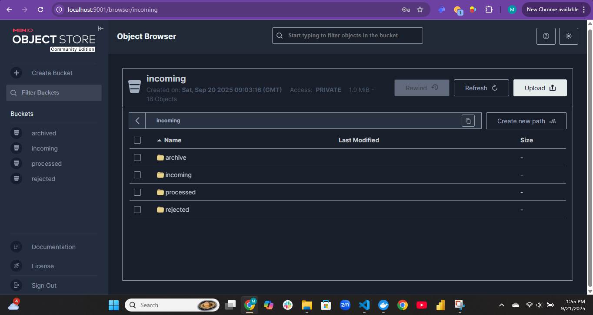
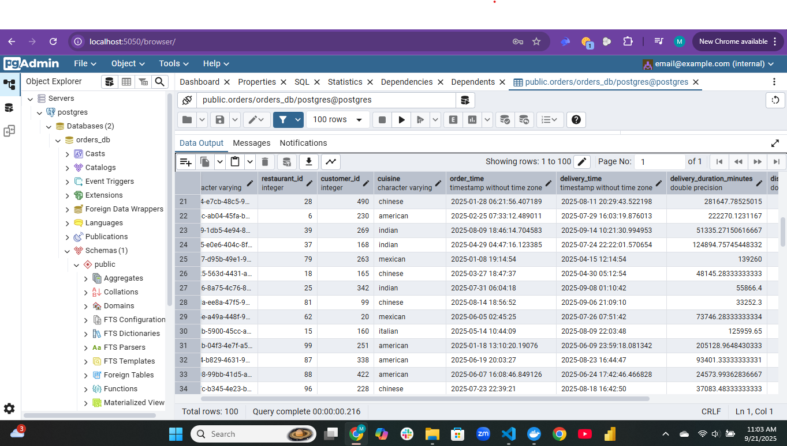
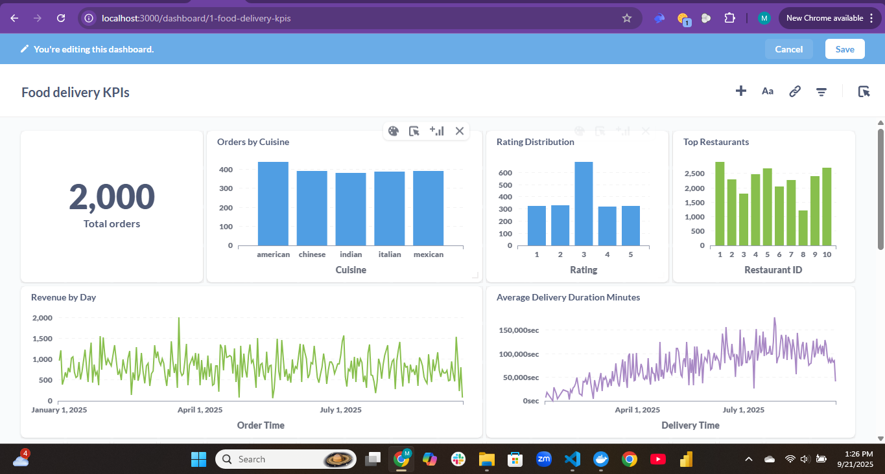

# Food Delivery Pipeline 

---

## Table of Contents

1. [Overview](#overview)
2. [Problem statement & Objectives](#problem-statement--objectives)
3. [Dataset](#3-dataset)  
4. [Architecture](#4-architecture)  
5. [Pipeline Workflow](#5-pipeline-workflow)  
6. [Airflow DAG Explanation](#6-airflow-dag-explanation)  
7. [How to Reproduce](#7-how-to-reproduce)  
8. [Challenges](#8-challenges)  
9. [Future Enhancements](#9-future-enhancements)  
10. [Screenshots](#10-screenshots) 

---

## 1. Overview <a name="overview"></a>

### 1.1 Executive summary

This project is a dockerized, event-aware data pipeline that simulates and ingests online food-delivery orders, validates and transforms them, stores them in a Postgres analytics database, and surfaces KPIs in Metabase. It was built with following production-grade patterns: event-driven ingestion, strict schema validation, idempotent upserts, file-level audit trails, and clear observability.


### 1.2 High-level components

* **Data generator** — produces synthetic CSV files that represent incoming orders (used for testing & demo).
* **MinIO (object store)** — three buckets/areas: `raw` (incoming), `processed` (accepted/archived), `rejected` (validation failures). MinIO stands in for S3 during local development.
* **Airflow (orchestrator)** — DAG `data_pipeline` orchestrates the flow: wait/sensor → generate  → validate → transform → upsert → archive. The DAG includes branching for validation outcome and small no-op nodes to make the control flow explicit.
* **Validator (Pandera)** — enforces schema, types, ranges, and business rules; returns structured validation results to `file_registry`.
* **Transformer** — normalizes columns, casts types, computes derived fields (e.g., delivery\_duration), and writes a canonical transformed CSV.
* **Upsert (DB loader)** — idempotent upsert logic (`INSERT ... ON CONFLICT DO UPDATE` or `MERGE`) into `orders` table and writes file-level metadata into `file_registry`.
* **Postgres (orders\_db)** — final data store for analytics; contains `orders` and `file_registry` tables.
* **Metabase** — analytic UI for dashboards and ad-hoc queries.
* **Observability** — Airflow logs, simple metrics, and Slack/webhook alerts for critical failures.

### 1.3 Data flow 

1. A new CSV lands in MinIO `raw/` (in production via the producer or upstream partner).
2. Airflow **sensor** detects the object (see Sensor notes below) and triggers the DAG run.
3. The DAG calls the Validator on the newest file.

   * If validation **passes** → Transformer → Upsert → Archive (move to `processed`) → mark file success in `file_registry`.
   * If validation **fails** → move file to `rejected`, write details to `file_registry`, and terminate the run gracefully (no exception-bubble).
4. Metabase queries Postgres for dashboards; analysts review KPIs.

> Note: for demo/test runs, the DAG includes a `generate_data` task to produce sample CSVs — this is intentionally part of the DAG to make end-to-end demos simple. The DAG is written so the **sensor-first** (wait) behavior remains the canonical event-driven pattern while the generator can be used as an emulation step in local testing.

### 1.4 Why sensor-first (event-driven) and implementation note

I standardised on a **sensor-first** approach to make the pipeline event-driven and reduce wasted runs. The rationale:

* **Event-driven** pipelines minimize latency — process as soon as data appears.
* **Cost and load**: sensors (especially deferrable sensors) are cheaper than high-frequency scheduled DAGs.
* **Operational clarity**: a sensor shows an explicit wait for external data in the DAG graph, which is easier for reviewers and auditors to understand.

Implementation options and recommended pattern:

* **Deferrable S3/MinIO sensor** (preferred): for Airflow 2.2+, implement a deferrable sensor (S3KeySensor-like) or a custom `MinioKeySensor` which uses the deferrable sensor base. Deferrable sensors yield the worker slot while polling, greatly reducing scheduler/workload costs.
* **Polling sensor**: simple implementation using `PythonSensor`  with a sensible poke interval (e.g., `poke_interval=30s`, `timeout=12h`). Works for local demos but not ideal for scale.
* **Push-based alternative (recommended for production at scale)**: use MinIO/S3 event notifications (webhook or message to a queue) to trigger a DAG run via the Airflow REST API or use a lightweight function that writes a record to a trigger table. This is more real-time and eliminates polling entirely.


### 1.5 Key engineering patterns applied

* **Idempotency**: ingestion uses a staging area and de-duplication logic before upsert; `orders.order_id` is the primary key and upsert uses safe merge semantics to avoid duplicates on replays.
* **Schema-as-code**: Pandera schemas live in code and are version-controlled; any schema change is a code change that must pass CI.
* **File-level audit trail (`file_registry`)**: every file processed writes an entry with `file_name`, `status`, `validation_ok`, `rows_processed`, `errors`, `processed_at`, and `run_id`. This enables traceability and replay.
* **Fail fast vs graceful handling**: validation failures do not throw unhandled exceptions that crash the DAG run; instead they branch to a rejection path so downstream jobs are not left in an inconsistent state.
* **Separation of concerns**: generator (test-only) is separate from production ingestion; transforms and upserts are isolated modules for easier testing.
* **Local-dev parity**: Docker Compose mirrors core production pieces (S3/MinIO, Postgres, Airflow) so behaviors are validated locally.


---

## 2. Problem statement & Objectives <a name="problem-statement--objectives"></a>

### 2.1 Problem statement

Modern analytics teams must quickly convert operational events (here: food delivery orders) into reliable, queryable datasets for business stakeholders. The primary problems we solve with this pipeline are:

1. **Unreliable input sources**: incoming CSVs may be malformed, contain invalid types, or carry business-rule violations (e.g., negative amounts, impossible distances). The pipeline must detect, quarantine, and surface these in an auditable way.
2. **Non-idempotent ingestion**: upstream systems may re-deliver files or re-run exports. The pipeline must be safe to re-run without creating duplicates or corrupting analytics.
3. **Lack of observability**: without structured logging and file-level metadata, it’s hard to track what was processed, when, and why failures occurred.
4. **Developer/deployment friction**: developers need a reproducible local setup for debugging, validation, and demos that resembles production behaviors.
5. **Operational cost and responsiveness**: naive schedule-based processing either delays data or wastes compute. The system needs to be event-aware and efficient.

### 2.2 Primary objectives (technical & acceptance criteria)

Below are the objectives I aimed to fulfil in this project, framed with measurable acceptance criteria where applicable.

**Objective A — Reliable, schema-validated ingestion**

* Implement Pandera-based validation that checks column types, nullability rules, allowed ranges (e.g., `distance_km` between 1 and 20), and rating constraints.
* Acceptance: invalid files are routed to `rejected` bucket and a `file_registry` row contains failure details; no downstream processing occurs for that file.

**Objective B — Idempotent, auditable upsert**

* Use staging + dedupe + upsert pattern. Implement upsert using safe DB semantics (`ON CONFLICT` / `MERGE`) and transactions. Record per-file metadata in `file_registry`.
* Acceptance: repeated ingestion of the same file should not create duplicate `order_id` rows; the `orders` table must remain consistent and `file_registry` must reflect successful/duplicate runs.

**Objective C — Event-driven orchestration with graceful branching**

* Use a sensor (or deferrable sensor) to detect new objects in MinIO and trigger processing; implement BranchPythonOperator for validation to route to success or rejection paths.
* Acceptance: when a file fails validation the DAG finishes cleanly without unhandled exceptions and the rejection path is observable in Airflow UI and `file_registry`.

**Objective D — Developer-friendly reproducibility**

* Provide a single-command local startup (`docker compose up -d --build`), a demo generator for synthetic data, and explicit demo scripts for replaying the full flow.
* Acceptance: a new developer can reproduce an end-to-end run (generator → Airflow run → data in Postgres → Metabase dashboard) using the README.

**Objective E — Observability & minimal alerting**

* Logs per-task in Airflow, structured `file_registry` records, and a basic Slack/webhook alert for critical failures.
* Acceptance: critical validation failures send a Slack message and file-level errors are queryable.

**Objective F — Clear road for production hardening**

* Document the migration path to production: deferrable sensors, S3 event notifications, secret management, migration scripts (Alembic), and CI that runs core DAG tasks in a sandbox.
* Acceptance: README contains a "Next steps for production" checklist and CI job templates.

### 2.3 KPIs & SLAs (recommended)

* **Data freshness SLA**: process new file within 5 minutes of arrival (tunable based on business need).
* **Validation coverage**: 100% of files processed must go through Pandera validation prior to upsert.
* **Idempotency**: 0 duplicates per run (validated by `count(distinct order_id)`).
* **Observability**: 100% of failed files must have an entry in `file_registry` with errors captured.

---


## 3. Dataset <a name="Dataset"></a>

The pipeline uses a synthetic dataset that simulates real-world online food delivery transactions. Data is generated with the Faker library and written into CSV files, which are later ingested from MinIO.

Schema Description:

order_id (string) — unique identifier per order (with intentional duplicates across files to test deduplication).

restaurant_id (int) — unique restaurant identifier.

customer_id (int) — unique customer identifier.

cuisine (string) — type of cuisine (e.g., Chinese, Indian, Italian).

order_time (datetime) — time when the order was placed.

delivery_time (datetime) — time when the delivery was completed.

distance_km (float: 1–20) — delivery distance in kilometers.

rating (int: 1–5, with ~2–5% nulls) — customer’s delivery rating.

amount (float: 5–50) — order transaction amount.


---

## 4. Architecture

The pipeline follows a **modern lakehouse-style architecture**, built fully with Dockerized services. It is structured around **zones, orchestration, validation, storage, and analytics**.

**Key Components:**

* **MinIO (S3-compatible storage)**

  * Acts as the data lake.
  * Organizes files into **raw**, **processed**, and **rejected** zones.
  * Ensures data lineage by archiving all files.

* **Apache Airflow**

  * Orchestrates the pipeline through DAGs.
  * Uses a **Sensor** to detect new file arrivals in the MinIO raw zone.
  * Executes tasks for validation, transformation, and loading.
  * Provides retry, logging, and monitoring for reliability.

* **Pandera (Schema Validation)**

  * Enforces strict data quality checks.
  * Categorizes issues into **warnings** (pipeline continues) and **critical errors** (pipeline halts).
  * Metadata is logged into Postgres for transparency.

* **Postgres (Data Warehouse)**

  * Stores structured data in fact and dimension tables.
  * Ingestion is **idempotent**, ensuring no duplicate records.
  * Acts as the single source of truth for downstream analytics.

* **Metabase (Analytics Dashboard)**

  * Connects directly to Postgres.
  * Provides dashboards and queries for stakeholders to visualize KPIs (e.g., revenue, ratings, delivery performance).

**Data Flow:**

1. CSV files generated → land in **MinIO raw zone**.
2. Airflow sensor detects file arrival → triggers DAG.
3. Files validated with Pandera → clean ones move to **processed**, bad ones to **rejected**.
4. Validated data → transformed and **upserted into Postgres**.
5. Metabase queries Postgres → dashboards created for insights.


---

Great 🙌 — here’s the **Pipeline Workflow** section written in a detailed, professional style:

---

## 5. Pipeline Workflow

The pipeline is orchestrated using **Apache Airflow**. It is designed as a modular DAG where each stage is clearly defined, fault-tolerant, and idempotent.  

 
**Workflow Steps:**

1. **File Sensor (MinIO Raw Zone)**

   * A dedicated **sensor** continuously watches the MinIO `raw/` bucket for new data files.
   * Once a new file arrives, the DAG is triggered.



2. **Data Validation (Pandera)**

   * The file is validated against a **strict Pandera schema**.
   * Checks include data types, nullability, ranges (e.g., distance 1–20 km, amount 5–50), and uniqueness of `order_id`.
   * Results are logged into the Postgres `file_registry` table for auditing.

3. **Branching Logic**

   * **Valid files** → moved into **processed zone**.
   * **Invalid files** → pushed into **rejected zone** with logs for debugging.
   * The DAG uses **branching operators** to handle these paths gracefully.

4. **Transformations**

   * Data cleaning: handling null ratings, normalizing column types.
   * Deduplication: removing duplicate `order_id`s.
   * Preparing final structured format for warehouse loading.

5. **Database Load (Postgres)**

   * Processed data is upserted into **fact tables** in Postgres.
   * Ingestion is idempotent:

     * New rows → inserted.
     * Existing rows → updated.

  

6. **Archival**

   * All files (raw, processed, rejected) are archived in MinIO to maintain lineage and traceability.

7. **Analytics (Metabase)**

   * Postgres tables are connected to **Metabase**.
   * Dashboards provide KPIs: average delivery times, cuisine popularity, revenue trends, and rating distributions.



**Reliability Features:**

* **Retries** on transient failures.
* **Task-level logging** for debugging.
* **Clear branching** for success/failure paths.
* **Observability** through Airflow’s web UI.


---


---

## 7. How to Reproduce

Follow these steps to set up and run the pipeline locally:

1. **Clone Repository**

   ```bash
   git clone <your-repo-url>
   cd <your-project-folder>
   ```

2. **Start Docker Environment**
   Make sure Docker & Docker Compose are installed, then run:

   ```bash
   docker compose up -d --build
   ```

   This starts:

   * **Airflow** (webserver, scheduler, metadata DB)
   * **Postgres** (data warehouse)
   * **MinIO** (S3-compatible storage)
   * **Metabase** (analytics dashboard)

3. **Access Services**

   * Airflow UI → `http://localhost:8080`
   * MinIO Console → `http://localhost:9001`
   * PgAdmin → `http://localhost:5050`
   * Metabase → `http://localhost:3000`

4. **Run the Pipeline**

   * Log into **Airflow** (`airflow` / `airflow` default creds).
   * Enable the DAG `data_pipeline`.
   * Trigger a manual run or drop a new file into the MinIO raw bucket.

5. **Validate Execution**

   * Check Airflow DAG run history for task status.
   * Confirm file movement between raw, processed, and rejected zones in MinIO.
   * Verify upserts in Postgres using PgAdmin.

6. **View Analytics**

   * Connect Metabase to Postgres (if not pre-configured).
   * Explore the pre-built dashboard or create new queries (e.g., top cuisines, average delivery distance, revenue by restaurant).


---

## 8. Challenges

Building this pipeline was not just about connecting tools together; it involved solving **practical engineering problems** that mirror what happens in production systems:

1. **Schema Drift & Data Quality**

   * Challenge: Input data sometimes contained missing ratings, out-of-range values (e.g., distance > 20 km), or duplicate `order_id`s.
   * Solution: Implemented **Pandera validation** with strict rules and branching logic. Invalid files are safely rejected without breaking the DAG.

2. **Idempotency in Loading**

   * Challenge: Running the DAG multiple times risked duplicate inserts.
   * Solution: Designed **idempotent upserts** in Postgres (insert new, update existing). This ensures consistent warehouse state even under retries.

3. **Orchestration & Dependencies**

   * Challenge: Ensuring downstream tasks only run when upstream steps succeed, while avoiding pipeline failures due to bad files.
   * Solution: Used **Airflow branching** and **dummy tasks** to model “wait → validate → transform → load → archive” while gracefully skipping invalid branches.

4. **Observability & Debugging**

   * Challenge: Debugging failed DAG runs without visibility into data lineage.
   * Solution: Logged validation results to Postgres (`file_registry`) and relied on Airflow’s retry mechanism + task-level logs.

5. **Environment & Tooling**

   * Challenge: Running multiple services (Airflow, Postgres, MinIO, Metabase) locally was resource-intensive.
   * Solution: Standardized everything in **Docker Compose**, ensuring reproducibility across machines with minimal manual setup.

6. **Archival & Lineage**

   * Challenge: In many pipelines, once data is processed, the raw files are lost — making audits impossible.
   * Solution: Implemented **file archival** in MinIO, preserving raw, processed, and rejected files for future traceability.

These challenges were crucial to solve because they mirror **real-world production constraints** in data engineering: reliability, repeatability, and trust in the data.

---


---

## 9. Future Enhancements

While the pipeline is fully functional, several improvements can make it **closer to a production-grade system**:

1. **Real-Time Processing**

   * Integrate **Kafka or AWS Kinesis** to capture streaming events instead of relying on batch file drops.
   * Use Airflow or Kafka Streams for near real-time ingestion and transformation.

2. **CI/CD & Testing**

   * Add automated tests for schema validation, transformations, and database upserts.
   * Implement GitHub Actions for CI/CD to build, test, and deploy changes seamlessly.

3. **Data Quality Monitoring**

   * Extend validation with **Great Expectations** or **Soda Core** for richer rules.
   * Add anomaly detection (e.g., sudden drop in orders or spike in delivery times).

4. **Observability & Alerting**

   * Push pipeline logs and metrics into **Prometheus + Grafana** for better observability.
   * Add **Slack/Email alerts** for failed DAG runs or schema mismatches.

5. **Scaling & Fault Tolerance**

   * Deploy on **Kubernetes** with Helm charts for scalability.
   * Add **Dead Letter Queues (DLQ)** to capture unprocessed data events safely.

6. **Data Modeling**

   * Evolve Postgres into a **star-schema warehouse** (fact + dimension tables).
   * Build **incremental KPIs** (e.g., revenue by week, repeat customers).

7. **Security & Governance**

   * Integrate authentication/authorization for MinIO and Metabase.
   * Add data encryption at rest and in transit.
   * Implement **role-based access control** for dashboards.

8. **Cloud Migration**

   * Move storage from MinIO to **AWS S3**, Postgres to **AWS RDS**, and orchestration to **MWAA (Managed Airflow)**.
   * This ensures higher availability, reliability, and scalability in production.

By addressing these enhancements, the project can evolve from a local prototype into a **robust enterprise data platform** capable of supporting real-world food delivery analytics.

---


